# BurgersFiniteDifferences
Finite difference solver for the 1D viscous Burgers equation in the Wolfram Language (Mathematica), validated against the exact solution obtained using the Cole-Hopf transformation.

# The finite difference method for the viscous Burgers equation

Explicit finite differences on a periodic, validated against the exact solution (using Cole-Hopf transformation)

Ruben Ranval 

### Introduction

The Burgers equation is a simple canonical one-dimensional model in which a convective nonlinearity competes with viscous diffusion. The reason, I'm using it is that it's the simplest equation that keeps the quadratic nonlinearity of Navier Stokes while remaining exactly solvable (which makes it an ideal benchmark for numerical methods).

In this notebook, I will solve the Burgers equation on a periodic domain with a fully explicit FD scheme, and thn validate the result againt the exact solution obtained through the Cole-Hopf transformation.

### The Mathematical problem

#### Governing equation

We want to solve

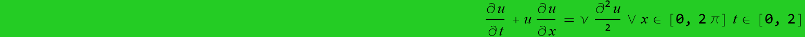

with periodic BCs and initial conditions 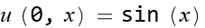. The advection term is taken in conservative form, 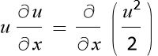, which is the form used for the discretization below. The constant 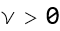 is the kinematic viscosity.

#### Physical behavior

Two mechanisms compete: the nonlinear term that steepens the profile, and for small \nu tends to form a shock, while diffusion smooths gradients and spreads the solution. Their balance is of course measured by the Reynolds number. With \nu = 0.5 (the default value of this notebook) the run is strongly diffusive: the initinal sine flattens and decays without forming a sharp front (as the results of the simulation will confirm).

### Numerical scheme

#### Spatial discretization

Space is discretized on a uniform periodic grid of N₀ points with spacing 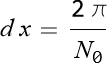. Writing uⱼ for the value at node j, both spatial terms use second - order central differences :

- for the advection term: 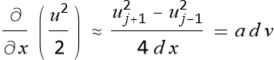

- for the diffusion term: 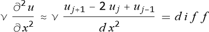

#### Time integration and stability

Time advances with explicit (forward) Euler, giving the classic foward time central space update: 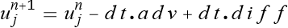.
FTCS is only conditionally stable. A Von Neumann analysis od the linearized equation gives the following amplification factor: 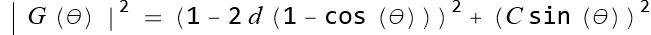, with 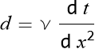, and 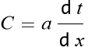 with 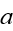 the local wave speed.

Stability (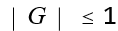 for every mode 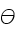) requires both 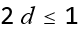 and 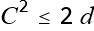. The step is therefore chosen as 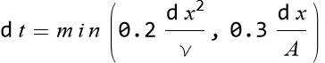 : the first term enforces the diffusion limit, the second the advective CFL limit (both with a safety factor).

### The actual implementation!

#### Setup: parameters and grid

We fix the domain, the physical parameters and the grid . N₀ is entered as a real number (256.0), this forces every downstream quantity to machine-precision arithmetic and prevents an exact symbolic 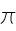 from being dragged through the time loop, which would make the run explode in symbolic size.

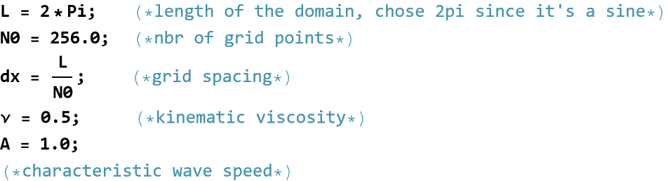

Now the two CFL limits we discussed in the previous section (with their safety factors):

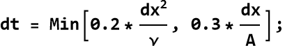

Now let's generate the timesteps and the initial conditions:

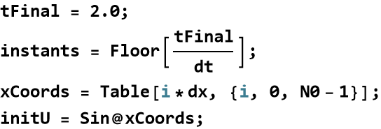

#### The time-stepping "kernel"

*stepBurgers* advances the whole field by one time step. It is written as a pure function of the state vector so it can be iterated cleanly. *uR* and *uL* represent the right/left neighbors via array rotation.

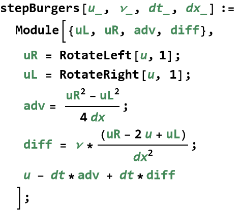

#### Time marching

We'll use *NestList* to build each time step iteratively using *stepBurgers* as the function we're applying, with *initU* as the initial conditions and *instants* the total number of timesteps.

```wl
In[]:= sol = NestList[stepBurgers[#, \[Nu], dt, dx] &, initU, instants];
```

The way we've structured our lists, we have *sol[[1, All]]* representing the solution at all 256 points of the 1D grid at the first instant, and *sol[[instants+1, All]]* representing the solution at all 256 points of the 1D grid at the last instant of the simulation.

```wl
In[]:= sol[[1, All]] == initU
```

```wl
Out[]= True
```

Likewise, *sol[[All, 42]]* represents the position of 42nd point of the grid at all timesteps. 

Now, let's look at the results!

### Results

Snapshots of the numerical solution at t = 0, 0.5, 1 and 2. The initial sine smooths and its amplitude decays monotonically: exactly what is expected in this diffusion dominated regime (here ν=0.5).

```wl
In[]:= GraphicsRow[
    Table[
       ListLinePlot[
     Transpose@{xCoords, sol[[Floor[t/dt] + 1]]}, PlotLabel -> "t = " <> ToString[t], 
     PlotRange -> {-1.2, 1.2}, 
     Frame -> True], 
       {t, {0, 0.5, 1.0, 2.0}}], 
   ImageSize -> 800]
```

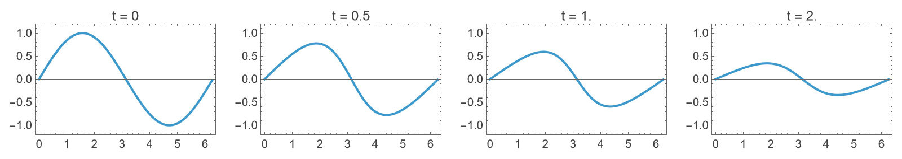

The substitution 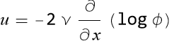 turns the nonlinear Burgers equation into the linear heat equation 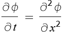. For 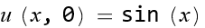 the matching heat-equation data is 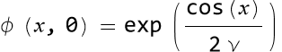. Expanding this with the generating function of the modified Bessel functions gives Fourier coefficients 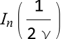, each mode then decays as 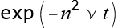. Reconstructing 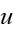 from 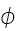 yields the reference solution below.

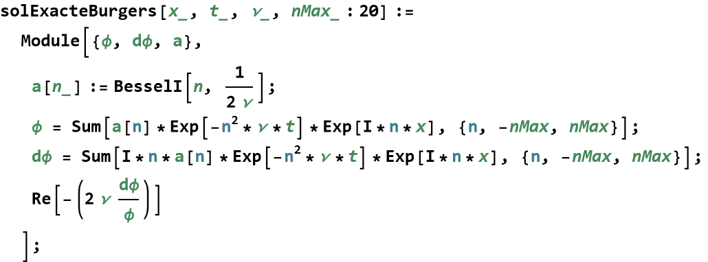

Subtracting the exact solution from the numerical one gives the pointwise error. It stays at the order of and below across the domain and shrinks in time as the solution smooths.

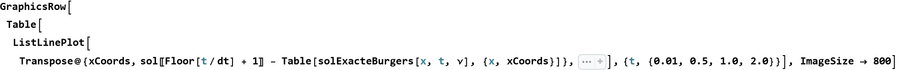

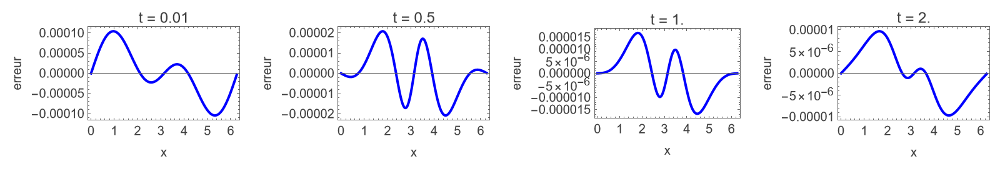

The exact solution is an infinite series truncated at nMax modes. The plot (shown at ν = 0.4) compares nMax = 1, 2, 3, 10, 20. A single mode is hopeless at early times, when the profile is steepest and richest in high harmonics, but the series converges fast: a handful of modes already coincide visually, and fewer are needed at later times once diffusion has erased the fine structure.

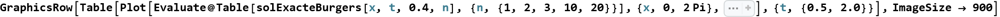

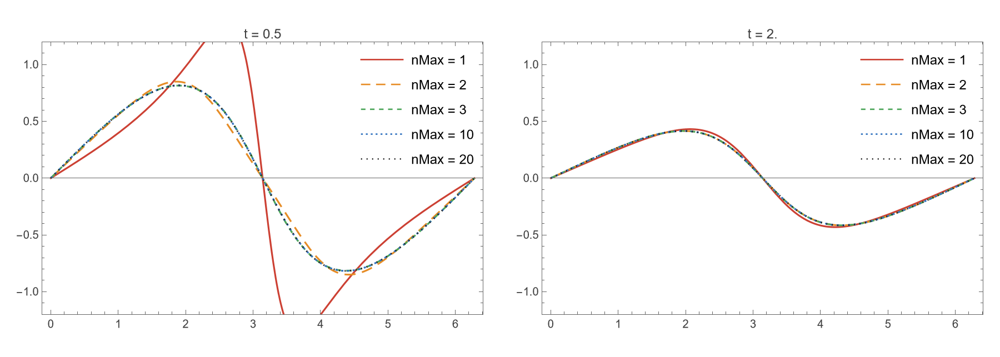
